# Frontend sitemap — `apps/web`

Captured 2026-09-08 from the local dev stack (`make dev`, SPA on `http://localhost:5173`,
auth/event/registration/payment on `:3000`–`:3003`) with seeded data.
Screenshots: `docs/screenshots/*.png` — 1440×900 viewport, 2× DPR, full-page.

Routing is **TanStack Router** file-based (`apps/web/src/routes`). A leading `_name.tsx`
file is a **pathless layout route**: it contributes no URL segment, only a `beforeLoad`
guard plus a shared shell. All access rules funnel through one pure function,
`apps/web/src/lib/route-access.ts` (`accessDecision`), so the redirect matrix is unit-testable.

## Route tree

```
/                                     public    landing
├── /events                           public    browse + filter (?q&category&province&page&pageSize)
│   └── /events/$eventId              public    detail + ticket checkout (auth required to buy)
├── /login                            public    sign-in / sign-up (email+password, Google)
│
├── _authenticated  ──── guard: signed in, else → /login
│   ├── /tickets                      attendee  issued tickets + QR
│   ├── /orders                       attendee  orders, payment status, refund
│   └── /profile                      attendee  account + "become an organizer" application
│
├── _organizer  ───────── guard: role=organizer AND approval=APPROVED (admin passes too)
│   │                     not signed in → /login · not approved → /profile
│   ├── /organizer/events                        list owned events
│   ├── /organizer/events/new                    create event
│   ├── /organizer/events/$eventId/edit          edit metadata / schedule / capacity
│   ├── /organizer/events/$eventId/images        S3 presigned cover-image upload
│   ├── /organizer/events/$eventId/sales         sales + capacity dashboard
│   └── /organizer/check-in                      QR scanner (?eventId)
│
└── _admin  ───────────── guard: role=admin, else → / (or /login)
    ├── /admin/users                  approve organizers, ban users
    ├── /admin/events                 moderate every event
    ├── /admin/payments               payment reconciliation / retry
    ├── /admin/audit                  audit log
    └── /admin/check-in               QR scanner across all events (?eventId)
```

`_organizer` and `_admin` render the same `DashboardShell` (sidebar + breadcrumb), differing
only by the `label` prop — an admin sees both the Organizer and the Administration groups
in one sidebar.

## Pages

### Public

| Route | File | Screenshot |
|---|---|---|
| `/` | `routes/index.tsx` |  |

Hero + featured events pulled from `event` via Eden Treaty. Entry point for the demo.

| Route | File | Screenshot |
|---|---|---|
| `/events` | `routes/events.index.tsx` | 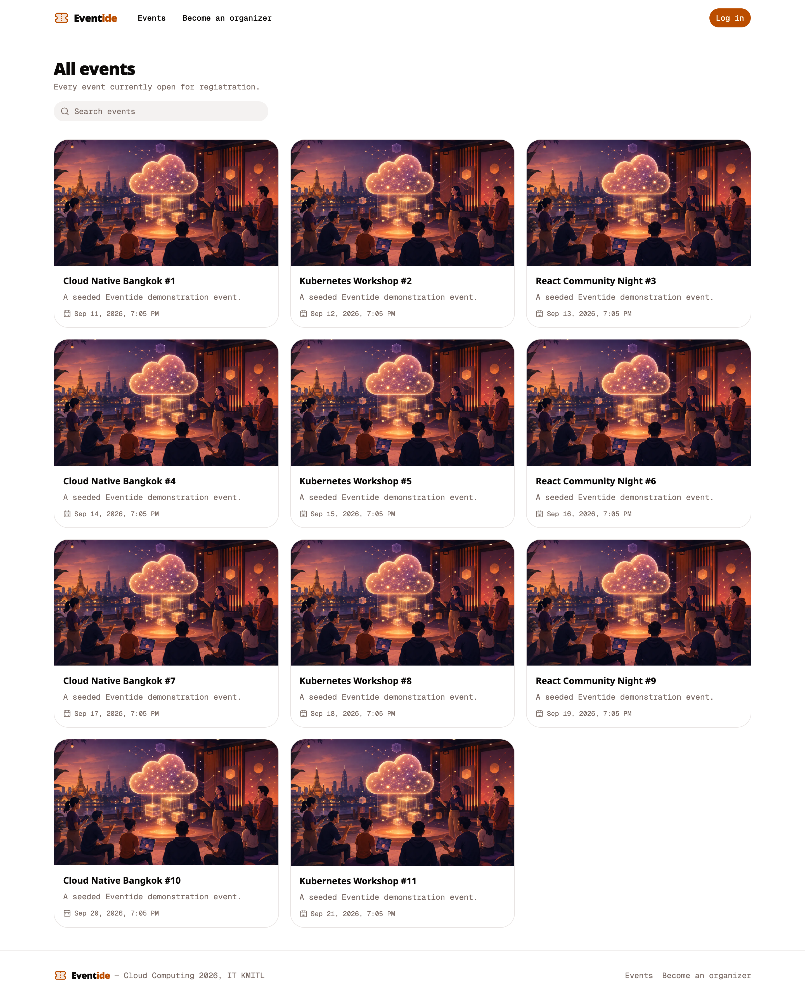 |

Search and filters are **URL state**, validated by `eventsSearchSchema` (`lib/search.ts`) —
`q`, `category`, `province`, `page`, `pageSize`. A bare `/events` normalises to
`/events?page=1&pageSize=20`, so any filtered view is a shareable link and back/forward work.

| Route | File | Screenshot |
|---|---|---|
| `/events/$eventId` | `routes/events.$eventId.tsx` | 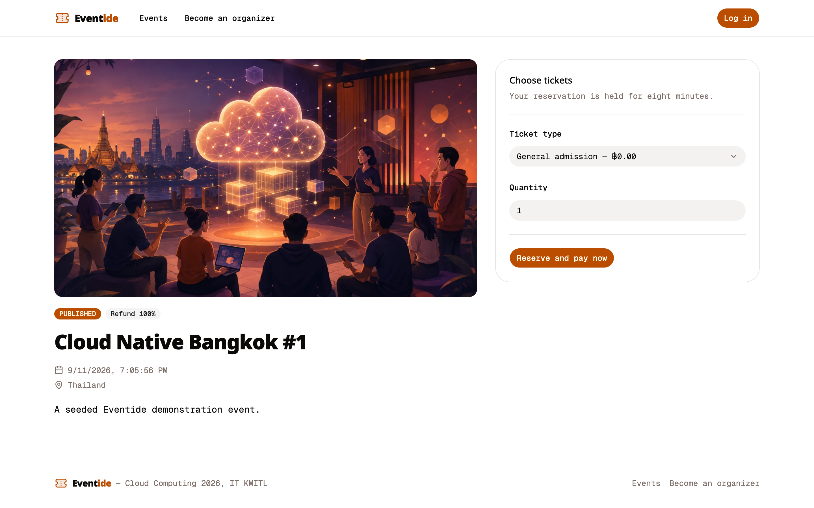 |

Event detail plus the ticket-type / quantity checkout panel. Signed out it prompts for login;
signed in the same page offers the reserve → pay flow — the screenshot pair
`03-event-detail.png` (anonymous) and `08-event-detail-auth.png` (attendee) shows both states.

| Route | File | Screenshot |
|---|---|---|
| `/login` | `routes/login.tsx` | 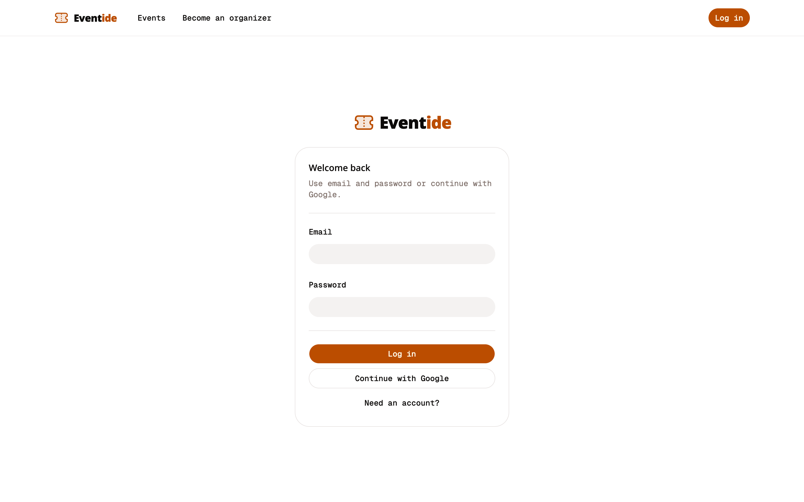 |

One card toggling between sign-in and sign-up (better-auth email+password), plus Google OAuth.
The session token from the `set-auth-token` header is stored in `localStorage` under
`eventide.bearer` — bearer, never cookies, so dev and deployed behave identically.

### Attendee — `_authenticated` (signed in)

| Route | File | Screenshot |
|---|---|---|
| `/tickets` | `routes/_authenticated.tickets.tsx` | 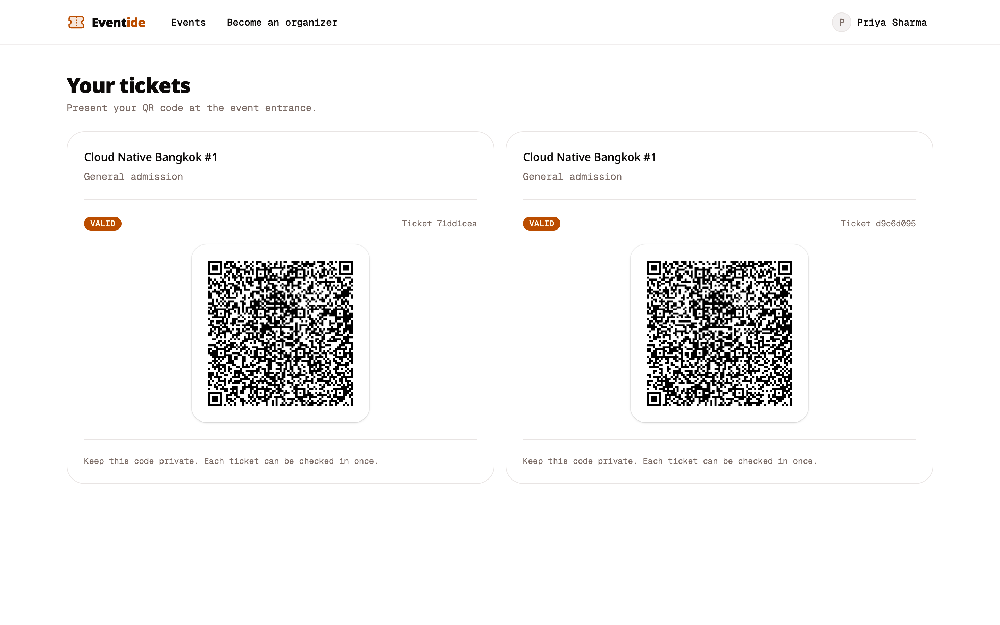 |

Issued tickets with the signed QR token rendered client-side, one card per ticket, status badge
(`VALID` / `CHECKED_IN`). Titles are enriched by `registration` calling `event` in-cluster —
the two databases are never joined.

| Route | File | Screenshot |
|---|---|---|
| `/orders` | `routes/_authenticated.orders.tsx` | 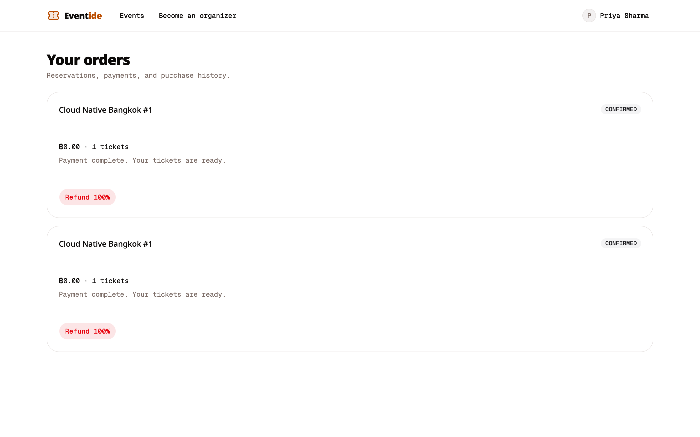 |

Order history with payment status and the refund action.

| Route | File | Screenshot |
|---|---|---|
| `/profile` | `routes/_authenticated.profile.tsx` | 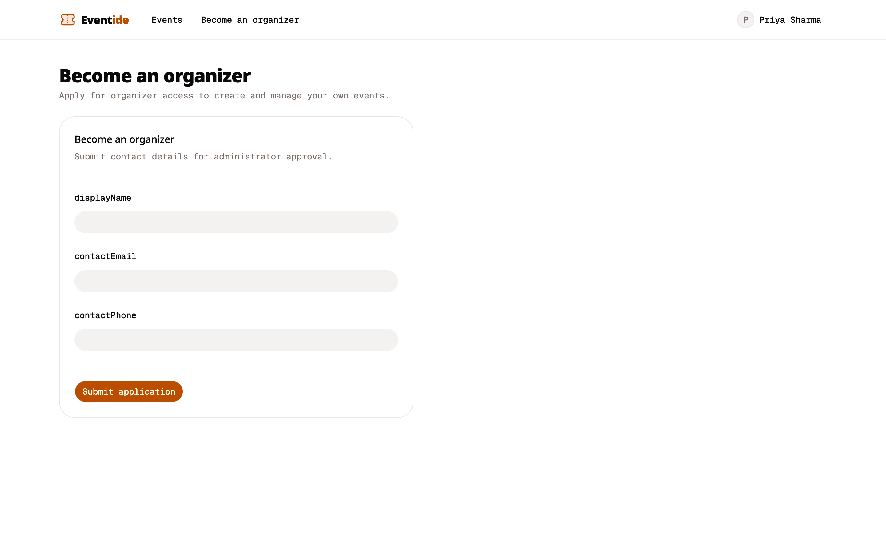 |

Account details and the organizer application form. This is the redirect target for a signed-in
user who hits an organizer route without approval — the guard sends people somewhere they can
act, not to a dead end.

| Route | File | Screenshot |
|---|---|---|
| `/events/$eventId` (signed in) | `routes/events.$eventId.tsx` | 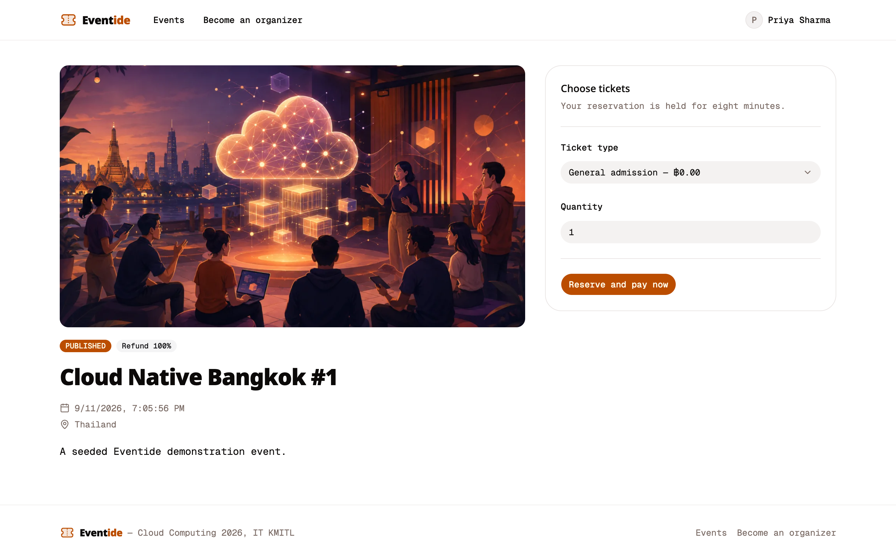 |

### Organizer — `_organizer` (role `organizer`, approval `APPROVED`)

| Route | File | Screenshot |
|---|---|---|
| `/organizer/events` | `routes/_organizer.organizer.events.index.tsx` | 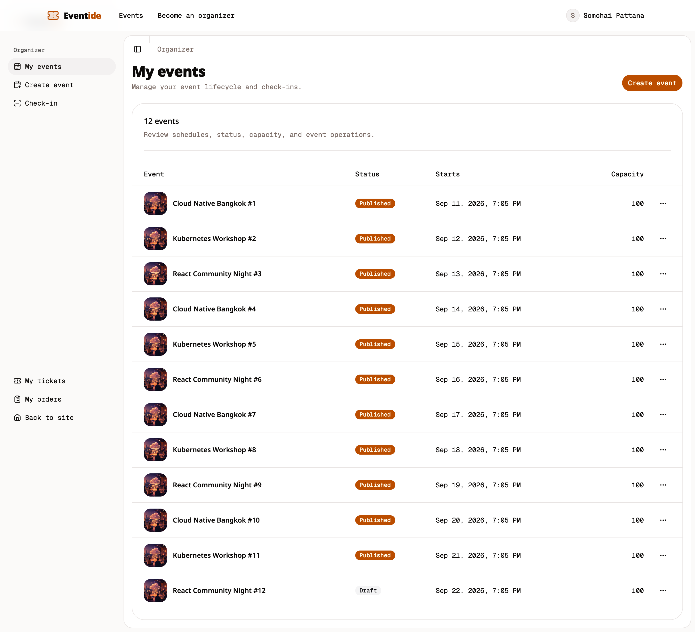 |

Owned events with status, start time, capacity and a per-row action menu
(publish / cancel / edit / images / sales).

| Route | File | Screenshot |
|---|---|---|
| `/organizer/events/new` | `routes/_organizer.organizer.events.new.tsx` | 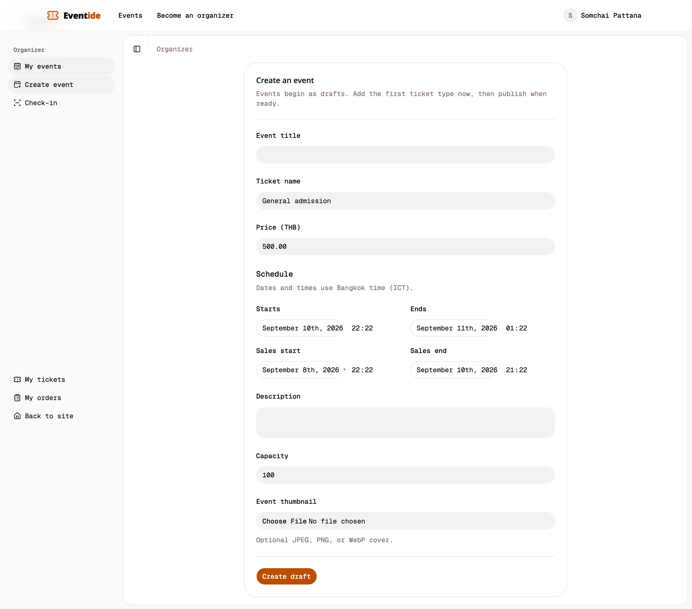 |

| Route | File | Screenshot |
|---|---|---|
| `/organizer/events/$eventId/edit` | `routes/_organizer.organizer.events.$eventId.edit.tsx` | 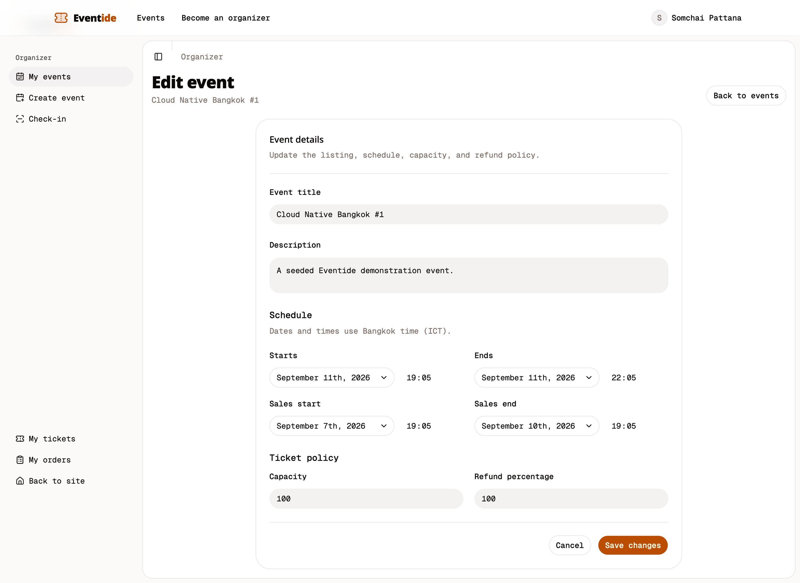 |

Metadata, capacity and the four datetime fields (starts / ends / sales start / sales end),
entered through the Bangkok-local `DateTimePicker` and sent as UTC.

| Route | File | Screenshot |
|---|---|---|
| `/organizer/events/$eventId/images` | `routes/_organizer.organizer.events.$eventId.images.tsx` | 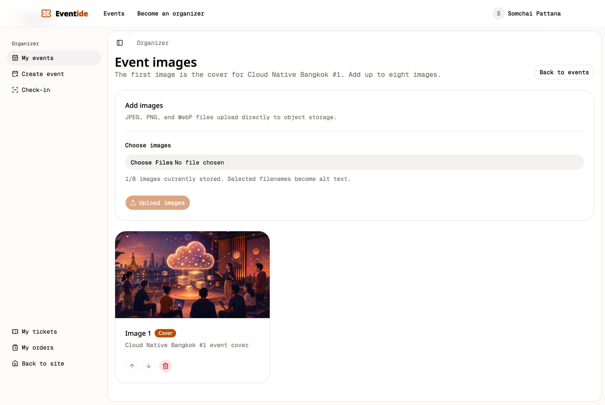 |

Cover-image upload via an **S3 presigned PUT** — the browser uploads straight to the bucket,
image bytes never enter the cluster. This is the page that demonstrates the S3 requirement.

| Route | File | Screenshot |
|---|---|---|
| `/organizer/events/$eventId/sales` | `routes/_organizer.organizer.events.$eventId.sales.tsx` | 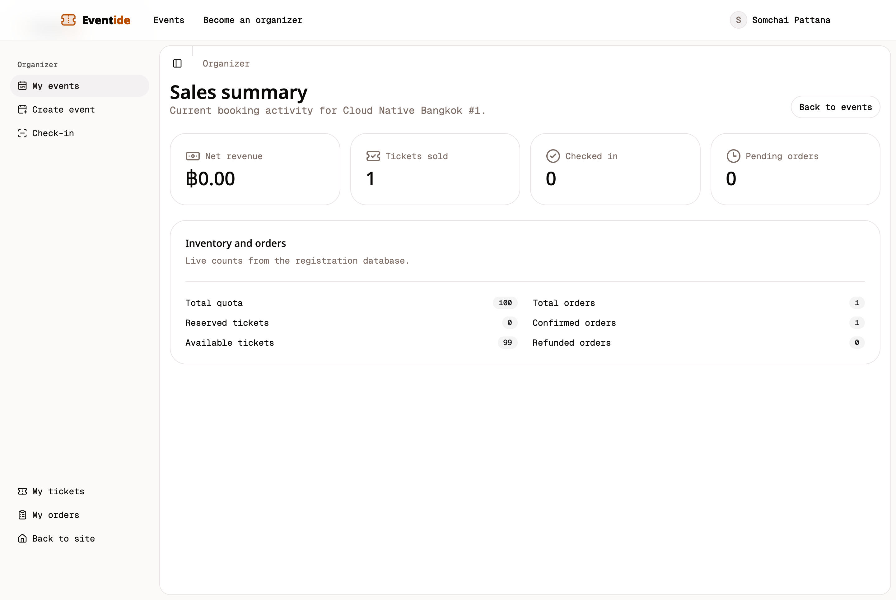 |

Sold / remaining / capacity, per ticket type. The numbers come from `registration`, which owns
capacity and counts its own rows in one transaction.

| Route | File | Screenshot |
|---|---|---|
| `/organizer/check-in` | `routes/_organizer.organizer.check-in.tsx` | 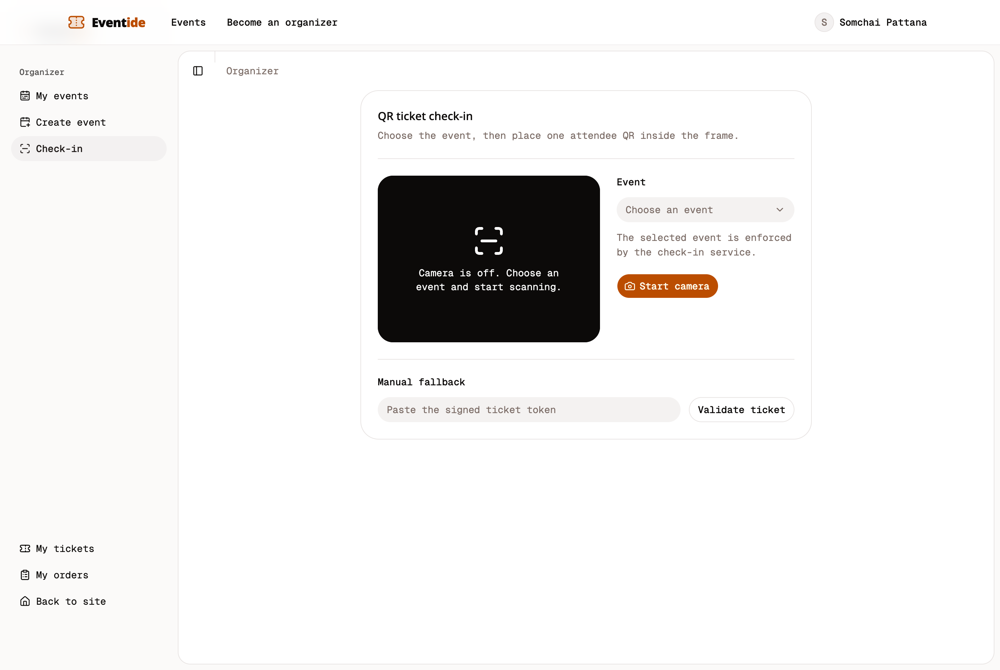 |

QR scanner: pick an event, start the camera, scan an attendee's ticket. A manual token field is
the fallback. *Screenshot shows the camera-off idle state — headless Chrome has no camera; on a
real device the frame shows the live video.* The selected event is enforced server-side, so a
ticket for another event fails even if it scans.

### Admin — `_admin` (role `admin`)

| Route | File | Screenshot |
|---|---|---|
| `/admin/users` | `routes/_admin.admin.users.tsx` | 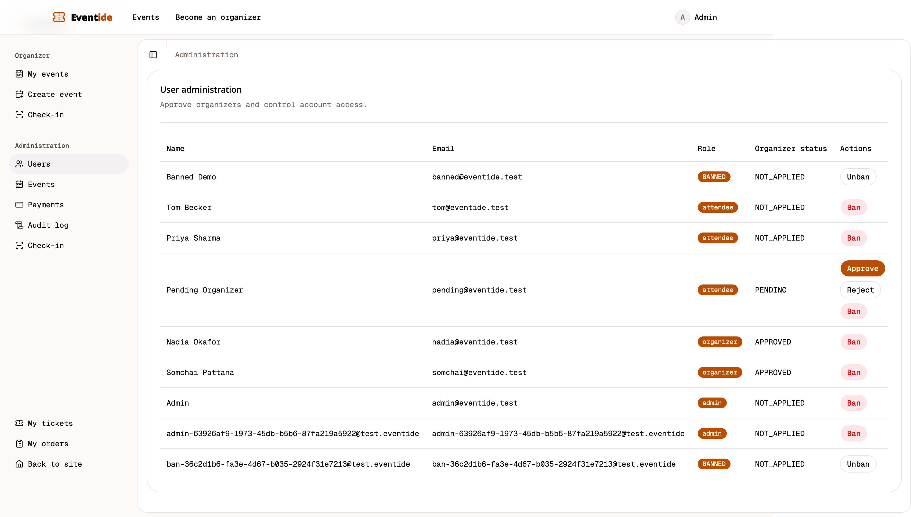 |

Approve or reject organizer applications, ban / unban accounts.

| Route | File | Screenshot |
|---|---|---|
| `/admin/events` | `routes/_admin.admin.events.tsx` | 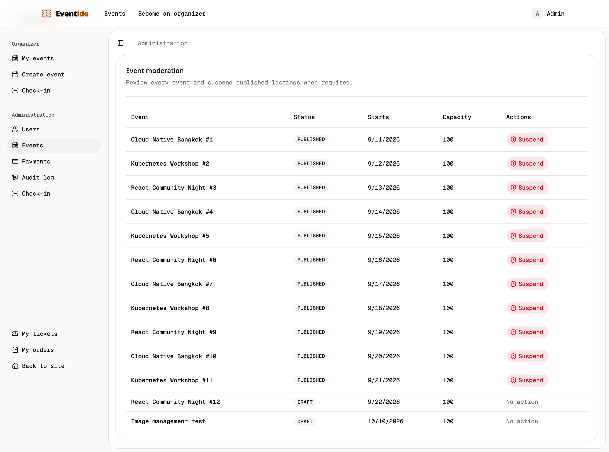 |

| Route | File | Screenshot |
|---|---|---|
| `/admin/payments` | `routes/_admin.admin.payments.tsx` | 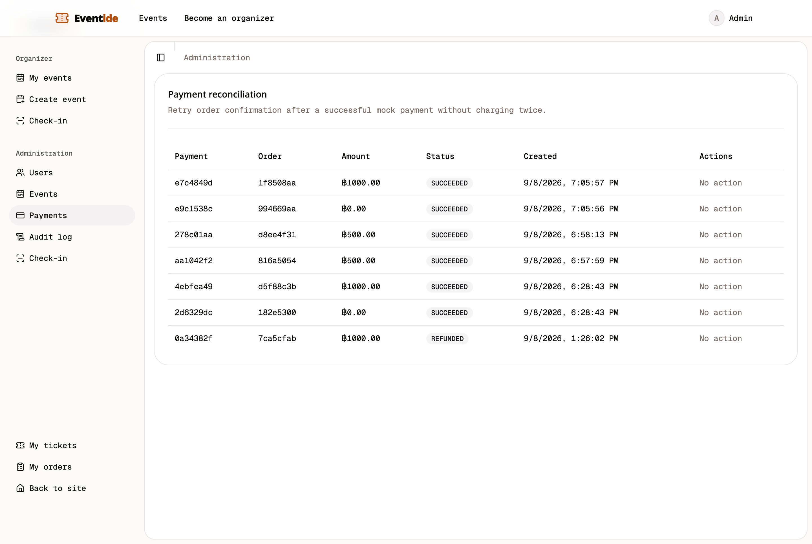 |

Payment reconciliation — retry order confirmation after a successful mock payment without
charging twice (the idempotency story).

| Route | File | Screenshot |
|---|---|---|
| `/admin/audit` | `routes/_admin.admin.audit.tsx` | 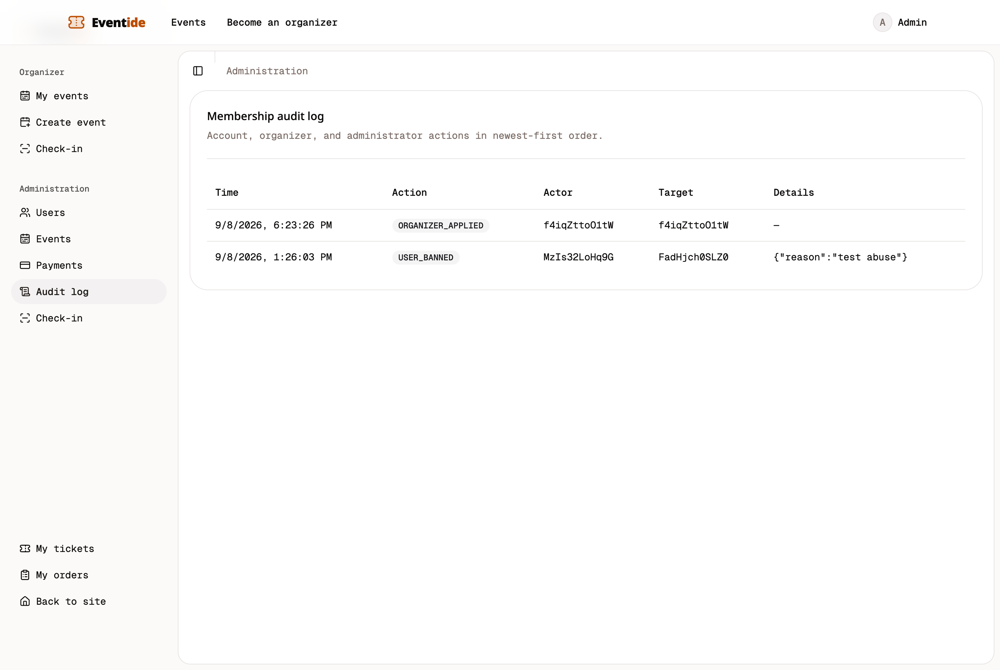 |

| Route | File | Screenshot |
|---|---|---|
| `/admin/check-in` | `routes/_admin.admin.check-in.tsx` | 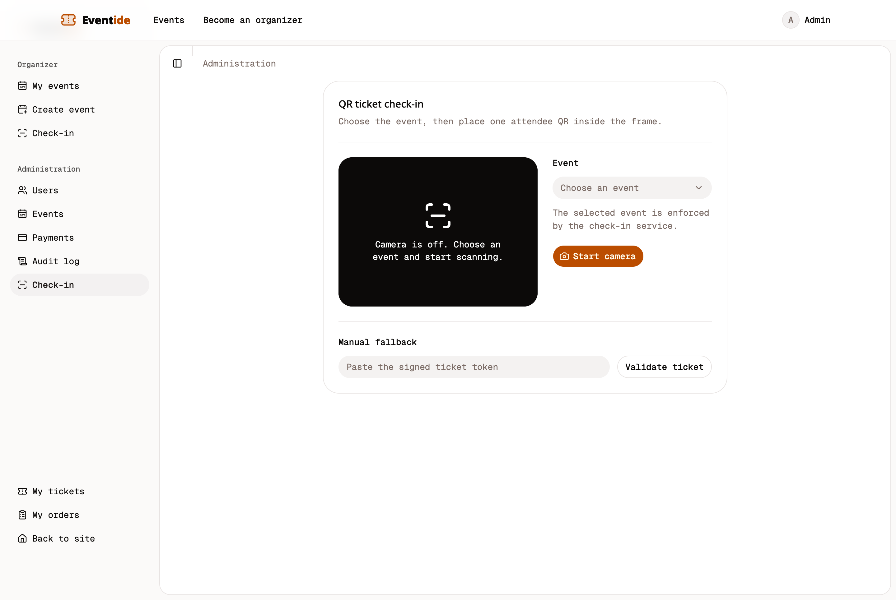 |

Same scanner component as the organizer's, scoped to every event.

## Access matrix

| Area | Signed out | Attendee | Organizer (pending) | Organizer (approved) | Admin |
|---|---|---|---|---|---|
| `/`, `/events`, `/events/:id`, `/login` | ✅ | ✅ | ✅ | ✅ | ✅ |
| `/tickets`, `/orders`, `/profile` | → `/login` | ✅ | ✅ | ✅ | ✅ |
| `/organizer/*` | → `/login` | → `/profile` | → `/profile` | ✅ | ✅ |
| `/admin/*` | → `/login` | → `/` | → `/` | → `/` | ✅ |

## Reproducing the screenshots

Demo accounts come from `packages/db/scripts/seed.ts` (password `seed-password-123`):
`admin@eventide.test` (admin), `somchai@eventide.test` (approved organizer, owns the 12 seeded
events), `nadia@eventide.test` (approved organizer), `pending@eventide.test` (applied, not
approved), `priya@eventide.test` / `tom@eventide.test` (attendees with seeded orders),
`banned@eventide.test` (banned).

Capture script: `scripts/screenshots.ts` — signs each persona in over the HTTP API, injects the
returned token into `localStorage` as `eventide.bearer`, then walks the route list with
puppeteer-core driving the installed Chrome (same setup as `apps/web/test/e2e.md`). Each
persona gets its own browser context, and a route that redirects away fails the run rather
than saving a misleading screenshot.

```sh
make dev && make seed
bun run scripts/screenshots.ts
```

`EVENT_ID` defaults to a seeded event owned by `somchai@eventide.test`; override it (along with
`WEB_URL`, `CHROME_PATH`, `SEED_PASSWORD`) after a re-seed.
